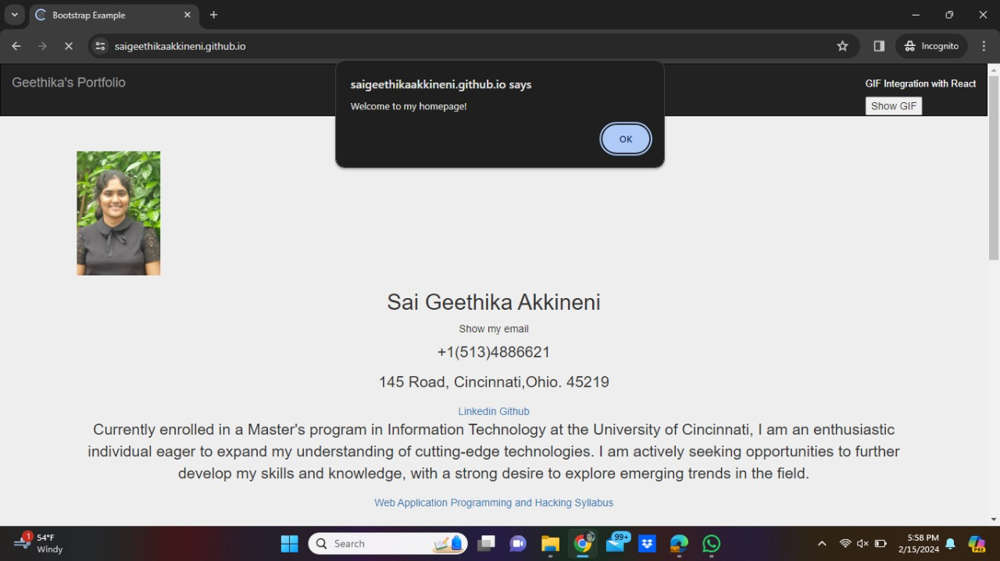
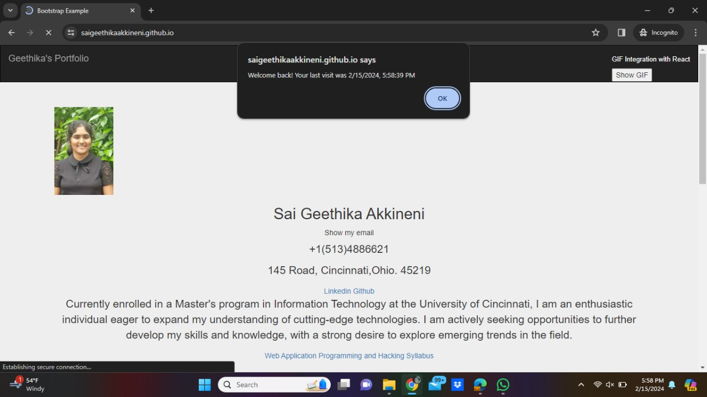
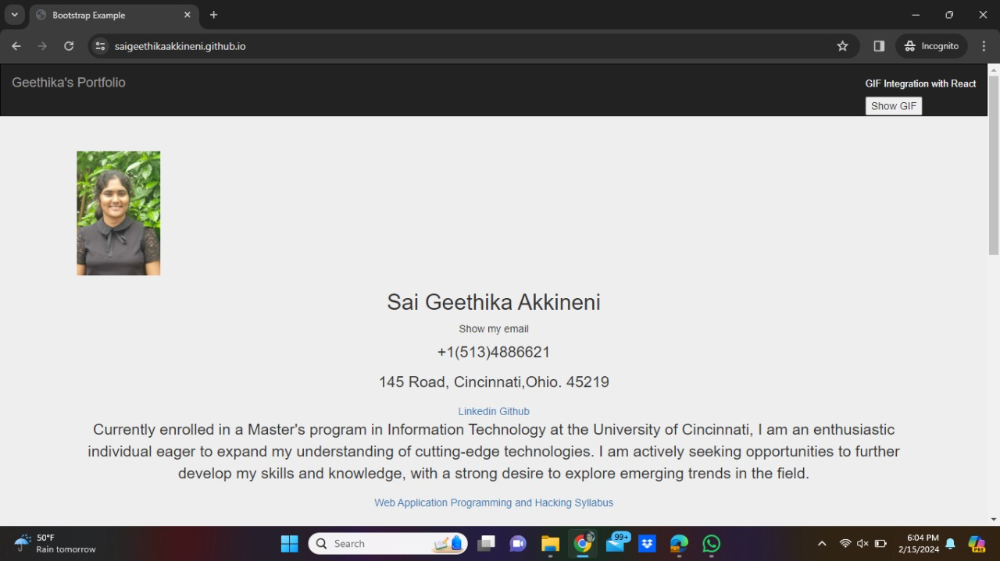
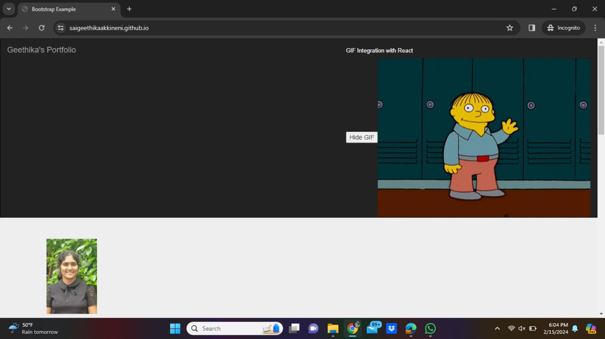

# WAPH-Web Application Programming and Hacking

## Instructor: Dr. Phu Phung

## Student name: Sai Geethika Akkineni

## Student mail: akkinesa@mail.uc.edu

{width=150px height=150px}

# Individual Project 1 - Front-end Web Development 

## Overview and Requirements 

This project utilizes the knowledge gained from lectures 1 to 6, covering various topics including HTML, CSS, JavaScript, Ajax, jQuery, and API integration. It begins with a basic HTML file showcasing personal information, followed by the implementation of functionalities such as email display toggling, analog and digital clock display, and GIF viewing, which were previously developed in Lab2. Subsequently, the project integrates APIs like JokeAPI and Weatherbit API. Moreover, JavaScript is employed to enable cookies, ensuring that users receive a welcome message on their first visit and a "Welcome back" message with the timestamp of their last visit upon returning to the page.I am attaching the link for website [https://saigeethikaakkineni.github.io/](https://saigeethikaakkineni.github.io/)

I have uploaded the code in my public repository [https://github.com/SaiGeethikaAkkineni/SaiGeethikaAkkineni.github.io](https://github.com/SaiGeethikaAkkineni/SaiGeethikaAkkineni.github.io)

### Task 1: Setup github.io

For this assignment, I followed the professor's recommendation and created a GitHub repository named saigeethikaakkineni.github.io, adhering to the specified naming convention. After creating it, I made the repository public. Then, I started by crafting an index.html file featuring a headshot of myself along with some basic HTML headings. Following the guidance from lecture 6, I cloned my saigeethikaakkineni.github.io repository into my local workspace. Subsequently, I created a new file named waph.html. I then transferred the code from my Lab2 into the index.html file as instructed.

#### a.Repository Creation and cloning:

   Afterward, you transitioned your GitHub repository to a public status, a crucial step in making your website accessible to everyone. By changing the visibility to public, you granted permission for anyone to explore your site and its contents, aligning with GitHub Pages' purpose as a platform for sharing projects.

With the repository now configured, you initiated the website's development by creating an "index.html" file. This file served as the foundation for the visual and structural elements of your site, featuring a headshot of yourself and basic HTML headings.

For offline editing and testing, you cloned your "saigeethikaakkineni.github.io" repository to your local workspace. This cloning process facilitated seamless experimentation with the website's structure, design, and content before pushing any modifications to the online repository. This approach ensured a smooth workflow between your local development environment and the GitHub repository.

Following guidance from a video lecture (Lecture 6), you expanded the website's content by introducing an additional HTML file named "waph.html." This file provided a platform for implementing more advanced features, potentially incorporating lessons learned from the lecture. By organizing content into separate HTML files, you maintained effective content management and laid the groundwork for building a comprehensive and dynamic website.

####  b. Bootstrap

The professor recommended incorporating Bootstrap into this assignment. To do so, you explored free Bootstrap themes online and selected one that suited your needs, modifying it accordingly. Additionally, you downloaded Bootstrap from the official website and integrated it into your HTML file. Furthermore, CSS was employed to enhance the design, including the addition of forms with divs and frames for images.

#### c. Javascript

Expanding on the functionalities introduced in lab2, I incorporated several features into the project. This included displaying analog and digital clocks, as well as implementing show/hide functionality for email elements. Moreover, I integrated external APIs like JokesAPI and Weatherbit API directly into the index.html file.

The JokesAPI was utilized to display a random joke every minute, adding an element of humor to the webpage. On the other hand, the Weatherbit API was employed to fetch and showcase real-time weather conditions for a specified location. To use the Weatherbit API effectively, a unique API key was generated for each user and included within the code.

Additionally, I integrated the Flag Counter website into the index.html, which dynamically adds a new country flag whenever a new visitor views the page. This feature serves to visually represent the diversity of visitors to the website.

To enhance user experience, cookies were enabled within the website. Upon initial visit, users are greeted with a warm welcome message. For returning visitors, a "welcome back" message is displayed along with the timestamp of their previous visit. This cookie-based feature helps users track their interactions with the website and ensures a personalized experience. The lifespan of these cookies was set to 30 days, striking a balance between usability and user privacy.

Furthermore, I incorporated a GIF into my website utilizing React.js. The button offers two options: show or hide the GIF. Upon clicking "show GIF," the GIF is displayed within a frame. Subsequently, users are provided with a "hide GIF" button, enabling them to minimize the GIF screen.

